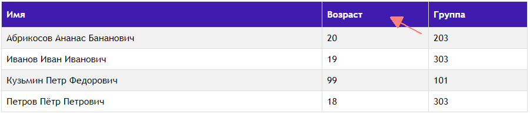

# Сортировка

Есть набор объектов Student. 

Задача:
* Представить объекты в виде таблицы
* Реализовать механизм сортировки таблицы по колонкам

## Коллекции в Java

* Вспомним ещё раз про ArrayList, как динамический массив объектов определённого типа.
* TreeMap - коллекция, в которой объекты сохраняются в отсортированном порядке по возрастанию, каждому объекту соответствует уникальный ключ.

## ArrayList
[Документация](https://docs.oracle.com/javase/7/docs/api/java/util/ArrayList.html)

Примеры.

Добавление объектов:
```Java
ArrayList<Student> students = new ArrayList<>();
students.add(new Student("Иванов Иван Иванович", 21, 403));
students.add(new Student("Абриков Алекс Петрович", 20, 303));
students.add(new Student("Петров Пётр Петрович", 18, 203));
```

Вывод объектов:

```Java
students.forEach(s -> System.out.printf("%s\t%d\t%d\n", s.getName(), s.getAge(), s.getGroupNumber()));
```
Результат:

```
Иванов Иван Иванович	21	403
Абриков Алекс Петрович	20	303
Петров Пётр Петрович	18	203
```

## TreeMap
[Документация](https://docs.oracle.com/javase/7/docs/api/java/util/TreeMap.html)

Примеры.

Добавление объектов:
```Java
Map<String, Student> studentsSortByName = new TreeMap<>();
students.forEach(s -> studentsSortByName.put(s.getName() + s.hashCode(), s));
```

Вывод объектов:

```Java
studentsSortByName.forEach((key1, value1) -> System.out.printf("%s\t%d\t%d\n",
                                                value1.getName(),
                                                value1.getAge(),
                                                value1.getGroupNumber()));
```
Результат:

```
Абриков Алекс Петрович	20	303
Иванов Иван Иванович	21	403
Петров Пётр Петрович	18	203
```

Сортировка по возрасту в обратном порядке:

Добавление объектов:
```Java
Map<String, Student> studentsSortByAge = new TreeMap<>(Collections.reverseOrder());
students.forEach(s -> studentsSortByAge.put(s.getAge() + " " + s.hashCode(), s));
```

Вывод объектов:

```Java
studentsSortByAge.forEach((key, value) -> System.out.printf("%s\t%d\t%d\n",
                                            value.getName(),
                                            value.getAge(),
                                            value.getGroupNumber()));
```

Результат:

```
Иванов Иван Иванович	21	403
Абриков Алекс Петрович	20	303
Петров Пётр Петрович	18	203
```

## hashCode
[Документация](https://docs.oracle.com/javase/7/docs/api/java/lang/Object.html#hashCode())

---
hashCode - число, которое является хеш-кодом объекта.
---
# Создадим файл sorted.jsp

## За обработку клика по заголовку колонки будет отвечать функция javascript:

```HTML
<script>
    function toLink(req) {
        document.location.href = "sorted.jsp" + req;
    }
</script>
```

## Получаем параметры, формируем список
```Java
    //Получаем список из БД
    ArrayList<Student> students = new DBStudent().getAllStudents();
    //Получаем параметры HTTP запроса
    String upper = request.getParameter("upper");
    upper = (null == upper || upper.equals("0"))?"1":"0";
    String sort = request.getParameter("sort");
    sort = null != sort?sort:"";
    //Для сортировки используем TreeMap
    Map<String, Student> studentsSorted;
    studentsSorted = upper.equals("0")?new TreeMap<>():new TreeMap<>(Collections.reverseOrder());
    //Добавляем объекты в TreeMap для сортировки по выбранным критериям
    switch (sort) {
        case "name": students.forEach(s -> studentsSorted.put(s.getName() + s.hashCode(), s));
            break;
        case "age": students.forEach(s -> studentsSorted.put(s.getAge() + " " + s.hashCode(), s));
            break;
        case "group": students.forEach(s -> studentsSorted.put(s.getGroupNumber() + " " + s.hashCode(), s));
            break;
        default: students.forEach(s -> studentsSorted.put(s.getId() + " ", s));
```

## Обработка нажатий
```HTML
    <tr>
        <th onclick="toLink('?sort=name&upper=<%= upper%>')">Имя</th>
        <th onclick="toLink('?sort=age&upper=<%= upper%>')">Возраст</th>
        <th onclick="toLink('?sort=group&upper=<%= upper%>')">Группа</th>
    </tr>
```

## Вывод строк

```Java
        ArrayList<Student> studentsList = new ArrayList<>();
        studentsSorted.forEach((key, value) -> studentsList.add(value));
        for (Student s: studentsList) {
            String row = String.format("<tr><td>%s</td><td>%d</td><td>%d</td></tr>",
                    s.getName(), s.getAge(), s.getGroupNumber());
            out.print(row);
        }
```
---
[Код sorted.jsp](web/sorted.jsp)
---
# Результат:
 
---
 
---
 